# Laboratorio 1 RDC / Red - Interconexión
  
## 1. Inicio
### Introducción:
En este proyecto, se aborda el desafío de proporcionar una solución de red eficiente para Fernando Pérez y su familia, quienes desean navegar sin problemas por el sitio web de DisneyPlus desde sus computadoras personales y teléfonos celulares. Utilizando Cisco Packet Tracer, hemos desarrollado una red que garantiza la conectividad y el acceso seguro a internet desde los dispositivos de todos los miembros de la familia.

El propósito de este proyecto es aplicar los conocimientos adquiridos en temas de redes, incluyendo la configuración de dispositivos de red, la elección de tipos de redes y topologías adecuadas, y la implementación de servicios como DNS y DHCP. A través de esta solución, se busca ofrecer una experiencia de navegación fluida y sin interrupciones para todos los usuarios dentro de la red doméstica de la familia Pérez.

Este documento detalla el proceso de desarrollo de la solución, incluyendo la configuración de los elementos de red, la selección de la topología, y la implementación de los servicios y protocolos necesarios. Además, se incluyen las conclusiones y los desafíos encontrados durante el desarrollo del proyecto.
### Objetivos del Proyecto:
#### 1. Diseñar una Red Doméstica Eficiente:
+ Crear una red doméstica que permita a Fernando Pérez y su familia acceder al sitio web de DisneyPlus desde múltiples dispositivos, incluyendo computadoras personales y teléfonos celulares, sin interrupciones.
+ 
#### 2. Implementar Configuraciones de Red:
+ Configurar routers, switches, y puntos de acceso utilizando Cisco Packet Tracer para garantizar una conectividad estable y segura en toda la red.
+ 
#### 3. Optimizar la Navegación Web:
+ Asegurar que la red esté configurada para ofrecer tiempos de carga rápidos y una experiencia de usuario óptima al acceder a servicios de streaming como DisneyPlus.
+ 
#### 4. Aplicar Protocolos y Servicios Clave:

+ Implementar y configurar servicios esenciales como DNS y DHCP para facilitar la gestión de la red y la asignación de direcciones IP dinámicas.
+ Utilizar protocolos de comunicación como TCP/IP para garantizar la correcta transmisión de datos entre los dispositivos y el servidor de DisneyPlus.

### Miembros del equipo
+ Juan David Cetina Gómez
+ Mateo de Jesús Vanegas Correa
+ Sebastian Sanchez Sandoval

## 2. Configuracion de Red
### Descripción de los Dispositivos:
### Casa Perez
#### End Devices
+ 2 Tablets
+ 4 Smartphones
+ 1 Laptop
+ 3 PCs

#### Network devices
+ Access Point
+ Switch
+ Router

### Disney Plus
+ Router
+ Server

### Configuración de los Dispositivos y las redes:
Para llevar a cabo la solución del desafío del señor Fernando Pérez, fue necesario unir dos redes LAN (Local Area Network) para formar una red WAN (Wide Area Network), las dos redes LAN son la casa del señor Fernando Pérez y el servidor DNS de Disney Plus.

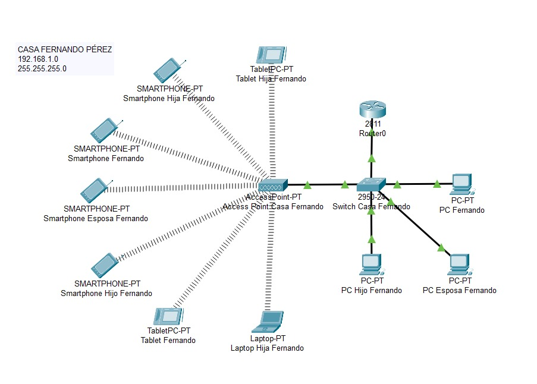
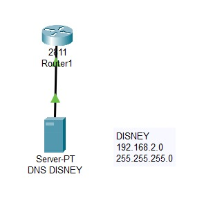
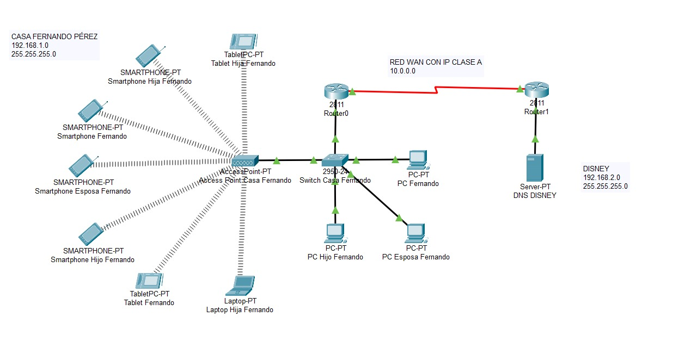

Estas redes tienen como direcciones ip 192.168.1.0 y 192.168.2.0 respectivamente. Dentro de la primera red, se encuentra el router conectado a un switch, a donde van conectados todos los dispositivos de la familia de Fernando Pérez desde donde se desea acceder a la página www.disneyplus.com, incluido el Access Point, que permite a los dispositivos como Smartphones, Laptops y Tablets conectarse de manera inalámbrica. Todos los dispositivos manejan una ip estática diferente entre ellos, comenzando con la ip 192.168.1.1, que es el router, y finalizando con un dispositivo de la familia Pérez con la ip 192.168.1.11. 

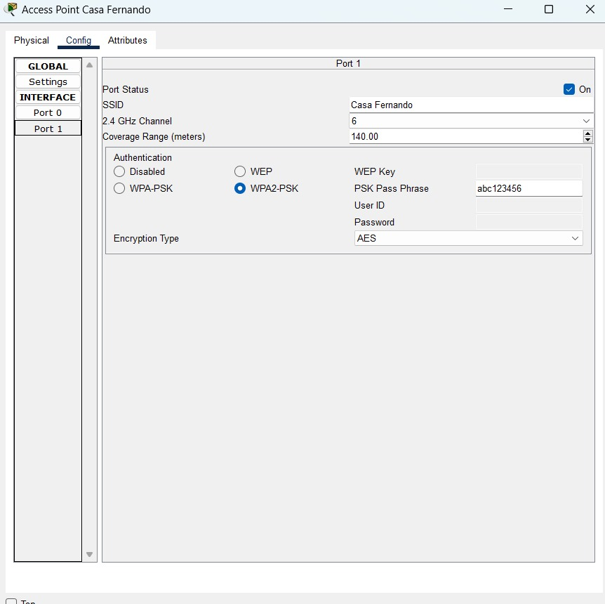

Como se puede ver en la imagen anterior, el Access Point fue configurado en el Puerto 1 para tener un SSID "Casa Fernando" y una autenticación WPA2-PSK "abc123456", que es lo que podriamos conocer en la cotidianidad como el nombre y la contraseña de una red wifi. Todos los dispositivos de la familia Pérez manejan una Máscara de subred 255.255.255.0, una puerta de enlace predeterminada 192.168.1.1 que es la ip del router de la red y un servidor DNS 192.168.2.2 que es la dirección ip del servidor DNS de Disney Plus que se encuentra en la otra red.

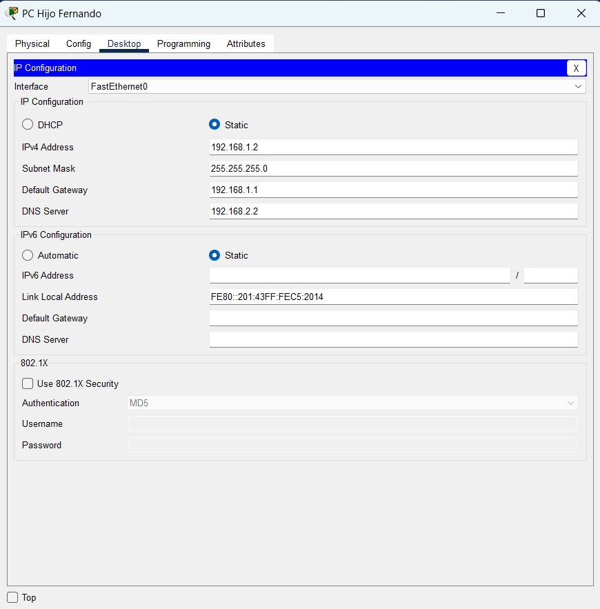
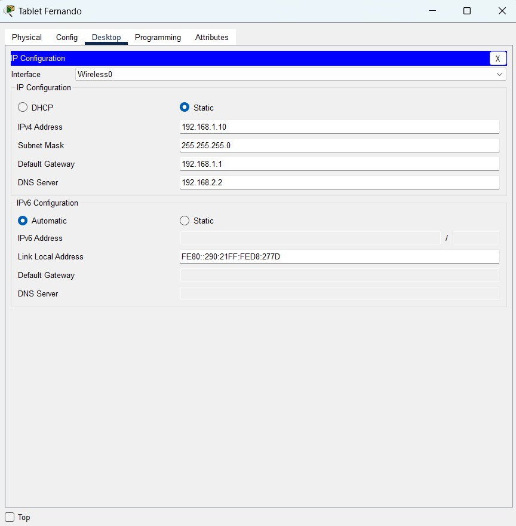

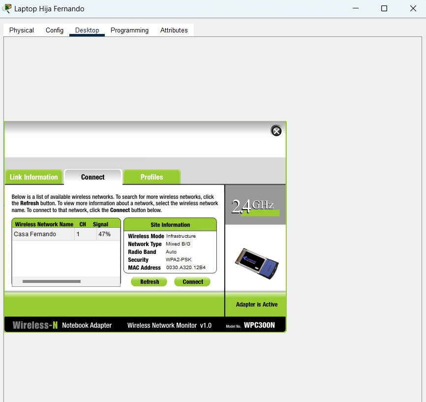

Por otro lado, tenemos el router de la segunda red, a donde va conectado el servidor de Disney Plus, que como se mencionó anteriormente, tiene una dirección ip estática 192.168.2.2, que está enlazada directamente al servicio DNS para la URL "www.disneyplus.com". Casi todos los componentes de la red final están conectados con cable de cobre directo, a excepción de los dos routers, que están conectados con un Serial DTE, como se puede apreciar en la siguiente imagen:

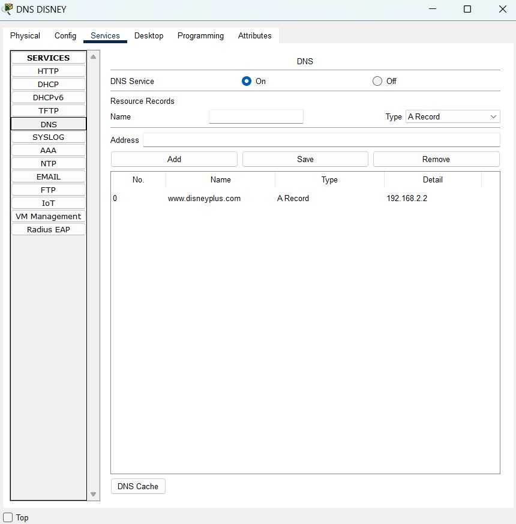
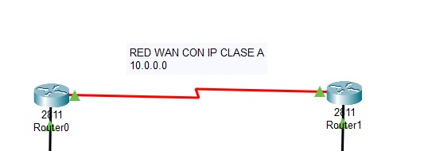

Adicional a esto, tanto en los routers como en las Laptops se realizaron ciertas modificaciones para que las conexiones de la red se pudieran realizar de manera correcta. Los routers se modificaron añadiéndoles un puerto WIC-2T, para que pudieran ser conectados con el Serial DTE; y a las laptops se les eliminó el módulo con conexión a cable Ethernet y se les añadió un módulo WPC300N, que permite la conexión inalámbrica con el Access Point.

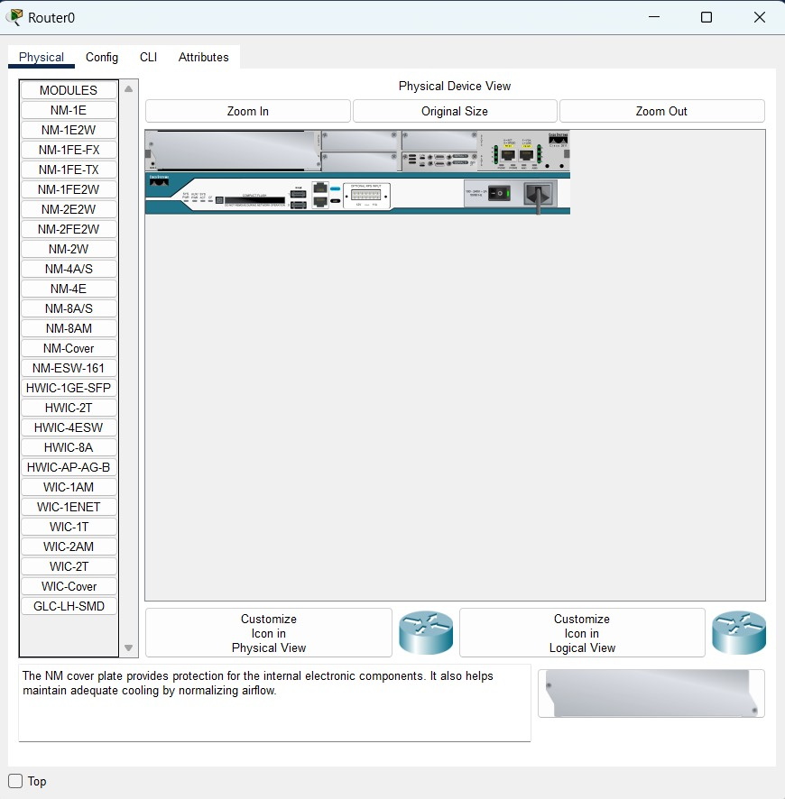
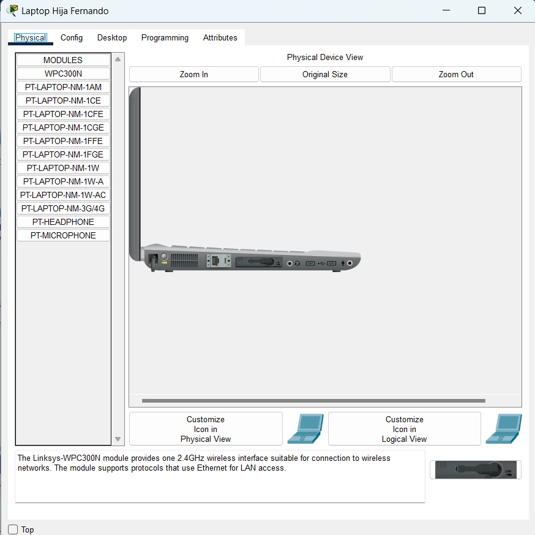

## 3. Topologías de Red
### Topología Seleccionada:
Descripción de la topología de red utilizada (estrella, bus, anillo, malla).

### Justificación de la Topología:
Razones por las cuales se eligió esa topología específica.

## 4. Arquitecturas y Servicios
### DNS y DHCP: 
Explicación de cómo se configuraron los servicios DNS y DHCP.

### Arquitectura de Red:
Descripción de la arquitectura general de la red.

## 5. Desafíos y Soluciones
### Problemas Encontrados:
Al momento de realizar el montaje en Cisco Packet Tracer los principales problemas encontrados fueron:
+ Conectar los dispositivos inalámbricos al switch
+ Conectar los routers de ambas redes
+ Conectar los dispositivos de la casa de Fernando Pérez al servidor de Disney Plus

### Soluciones Implementadas:
Para solucionar los problemas encontrados en el desarrollo del montaje se implementaron las siguientes soluciones respectivamente:
+ Utilizar un Access Point, configurando sus propiedades para la correcta conexión de los dispositivos que tendrían una dirección ip estática
+ Modificar la estructura física de los routers para que pudieran ser conectados mediante Serial DTE
+ Utilizar el servicio DNS del servidor definiendo la URL del sitio de Disney Plus y enlazando la dirección ip del servidor

## 6. Conclusiones
Resumen de los resultados obtenidos. Reflexión sobre lo aprendido durante el proyecto.

Uno de los aprendizajes adquiridos del desarrollo del laboratorio fue el entendimiento de las redes independientes y sus posibles conexiones, ya que, la red completa está compuesta por tres subredes, la de la casa de Fernando Pérez, la de Disney Plus y la que conecta ambos routers. Fue necesario aprender a manejar las direcciones ip de cada uno de los dispositivos de las redes y realizar las respectivas conexiones requeridas para el correcto funcionamiento de la red, tales como las configuraciones del Access Point y las configuraciones de los trouters para que estén conectados entre sí. 

## 7. Referencias
### Bibliografía:
Listado de referencias utilizadas para el desarrollo del proyecto.

